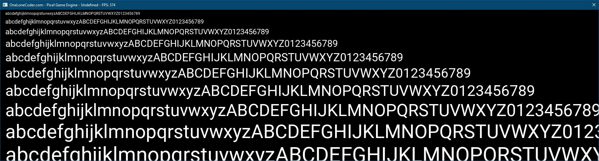
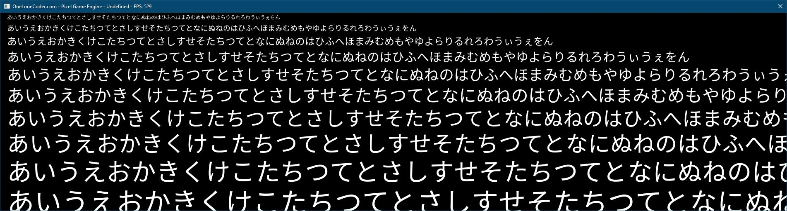
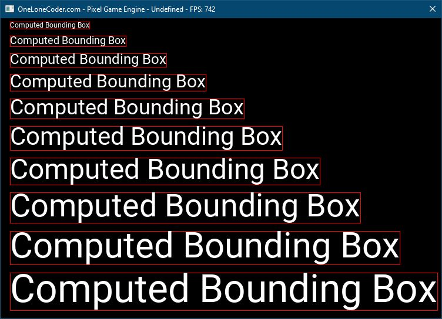

# Ayodehi's OLC PGE Extensions

This repository contains a few extensions that may be of use to developers using
OneLoneCoder's PixelGameEngine (https://github.com/OneLoneCoder/olcPixelGameEngine).

In this early release, the code is not in a particularly friendly, optimized,
or possibly even correct state. However, you are free to do what you will with it
or use it to figure out how to implement better fonts in your own application.

# Features

* Support for TTF and OTF fonts
* Unicode (wchar_t) support (append `W` to the end of the function names)

* Compute bounding box of a string
* olc::bbox templated struct (a quad of x, y, h, w)

# Requirements

The font extension uses FreeType 2 to read and process TTF fonts. More information
can be found here: https://www.freetype.org/index.html

# Changes Coming

This library is in a volatile state and will change. Do not expect backwards
compatibilty right now.

Among the planned changes are:

* Dynamic glyph loading -- load and cache glyphs the first time they are seen
rather than at startup.
* Better code reuse and maintenace between `char` and `wchar_t` types.
* Linux/OSX support
* Rotation
* Optimizations for both memory & computation

# Contributing

The code will be cleaned up and documented in the coming weeks. Feel free to
raise issues and submit pull requests but understand that the code is currently
a work in progress!

# License
## The Unlicense

This is free and unencumbered software released into the public domain.

Anyone is free to copy, modify, publish, use, compile, sell, or
distribute this software, either in source code form or as a compiled
binary, for any purpose, commercial or non-commercial, and by any
means.

In jurisdictions that recognize copyright laws, the author or authors
of this software dedicate any and all copyright interest in the
software to the public domain. We make this dedication for the benefit
of the public at large and to the detriment of our heirs and
successors. We intend this dedication to be an overt act of
relinquishment in perpetuity of all present and future rights to this
software under copyright law.

THE SOFTWARE IS PROVIDED "AS IS", WITHOUT WARRANTY OF ANY KIND,
EXPRESS OR IMPLIED, INCLUDING BUT NOT LIMITED TO THE WARRANTIES OF
MERCHANTABILITY, FITNESS FOR A PARTICULAR PURPOSE AND NONINFRINGEMENT.
IN NO EVENT SHALL THE AUTHORS BE LIABLE FOR ANY CLAIM, DAMAGES OR
OTHER LIABILITY, WHETHER IN AN ACTION OF CONTRACT, TORT OR OTHERWISE,
ARISING FROM, OUT OF OR IN CONNECTION WITH THE SOFTWARE OR THE USE OR
OTHER DEALINGS IN THE SOFTWARE.